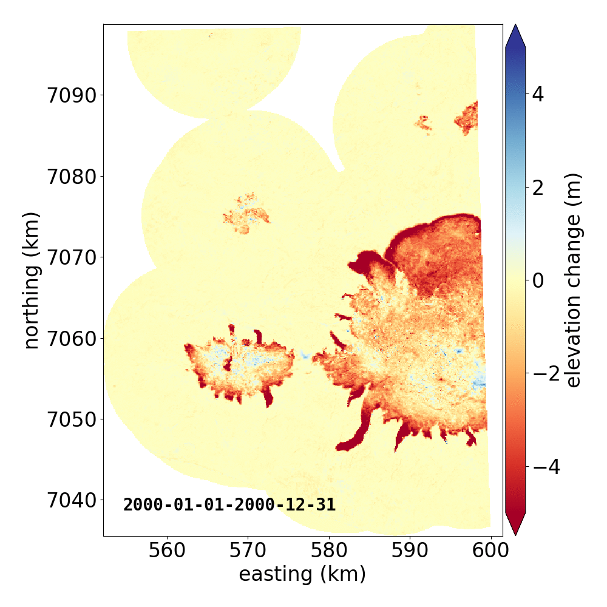
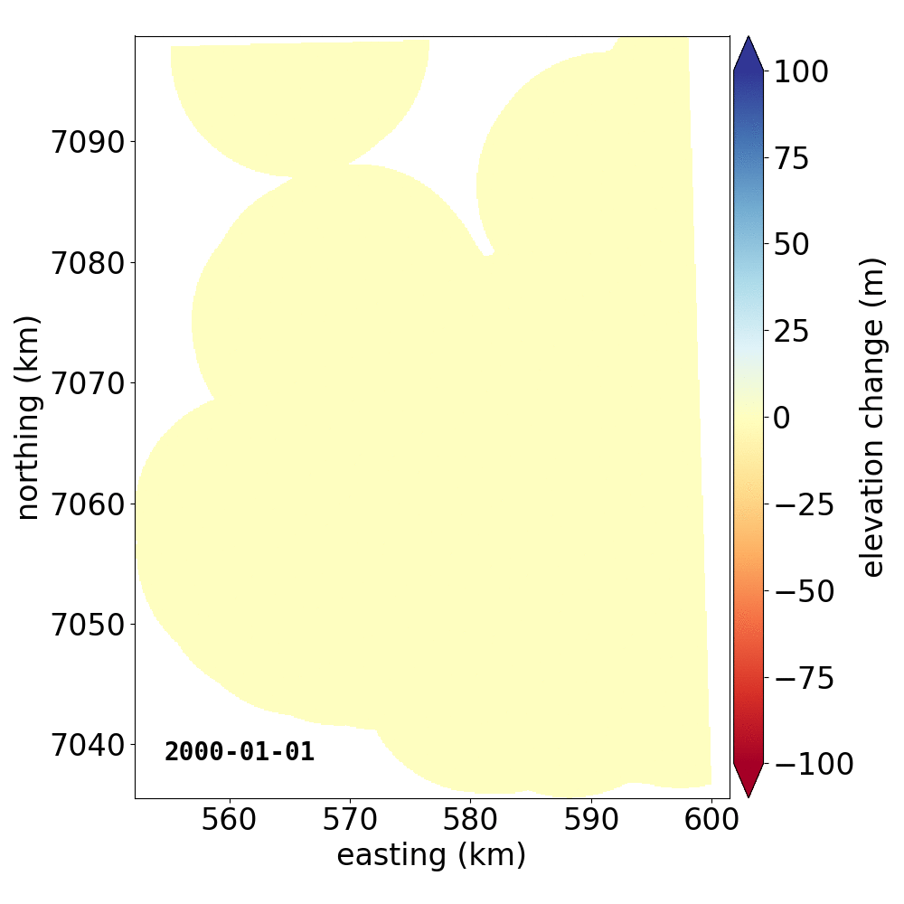

Fitting a time series of DEMs with pyddem
=========================================

Once you have :doc:`created <stack_dems>` a stack of DEMs, :mod:`pyddem.fit_tools` has a number of functions to fit
a time series of DEMs. The main function, which will take a stack of DEMs and produce a fitted time series,
is :func:`pyddem.fit_tools.fit_stack`, which can also be run using the command-line tool :doc:`pyddem/scripts/fit_stack`.

This assumes that you have first created a stack of DEMs following the instructions provided :doc:`here <stack_dems>`.

Least Squares fitting
#####################
:mod:`pyddem.fit_tools` offers two options for fitting a linear time series of elevation: ordinary and weighted least-squares.
These options work very well for areas with relatively sparse data, or where we don't see many non-linear changes
(i.e., no surges or rapid thinning events).

The following two examples show how to run weighted least squares (WLS) fitting using :func:`pyddem.fit_tools.fit_stack`.
The procedure for running ordinary least squares fitting is very much the same, simply swap out **method='wls'** for
**method='ols'**.

Running WLS fitting from a script
*********************************
This example shows how you can run :func:`pyddem.fit_tools.fit_stack` to fit a linear trend using
weighted least-squares  to a stack of DEMs. It will filter the raw elevations using a reference DEM and a spatial
filter, fit only pixels that fall within the provided land mask using 2 cores.
For more information on the various parameters, see :func:`pyddem.fit_tools.fit_stack`.
::
    import numpy as np
    from pyddem.fit_tools import fit_stack

    ref_dem = 'arcticdem_mosaic_100m_v3.0.tif'
    ref_dem_date = np.datetime64('2013-08-01')
    fn_landmask = '~/data/Alaska_Coastline.shp',

    fit_stack('my_stack.nc',
              fn_ref_dem=ref_dem,
              ref_dem_date=ref_dem_date,
              filt_ref='min_max',
              inc_mask=fn_landmask,
              nproc=2,
              method='wls')

The resulting fit will be written to a number of geotiffs:

* **fit_dh.tif** - the fitted linear rate of elevation change
* **fit_interc.tif** - the intercept of the linear fit
* **fit_err.tif** - slope error of the linear fit
* **fit_nb.tif** - number of valid observations per pixel
* **fit_dmin.tif** - first date with valid observation per pixel
* **fit_dmax.tif** - final date with valid observation per pixel

Running WLS fitting from the command line
*****************************************
This example will do the same as above, but using the command-line tool :doc:`pyddem/scripts/fit_stack`.
::
    fit_stack.py my_stack.nc -ref_dem arcticdem_mosaic_100m_v3.0.tif -ref_dem_date 2013-08-01 -f min_max
        -inc_mask ~/data/Alaska_Coastline.shp -n 2 -m wls

Gaussian Process Regression (GPR)
#################################
In addition to ordinary least squares and weighted least squares linear fitting, :func:`pyddem.fit_tools.fit_stack`
also models a time series of elevation using `gaussian process regression <https://scikit-learn.org/stable/modules/gaussian_process.html>`__
(GPR). This kind of fitting allows us to capture some of the nonlinear elevation changes seen over glaciers, for
example where large surges have taken place, or where thinning has accelerated due to dynamic processes.

Below are two example GIFs showing the fitted annual rate of elevation change, and the fitted cumulative elevation change
over Mýrdalsjökull, Iceland, between 1 January 2000 an 31 December 2019. It was created with an average of 68
observations (ASTER DEMs and `ArcticDEM <https://www.pgc.umn.edu/data/arcticdem/>`__ [1]_, [2]_ strips) per pixel.

Gaussian Process Regression takes as input a **kernel**, or a model of the variance :math:`\sigma_h(x,y,\Delta t)^2`
of the data. Here, we have explicitly programmed a kernel that is a combination of the following kernel functions:

.. math::
    \sigma_h(x,y,\Delta t)^2 = PL(x,y,\Delta t) &+& ESS(\phi_{per},\sigma_{per}^2,\Delta t) + RBF(\Delta t_{loc}, \sigma_{loc}^2, \Delta t) \\
        &+& RQ(\Delta t_{nl}, \sigma_{nl}, \Delta t) * PL(x,y,\Delta t) + \sigma_h(t,x,y)^2

with:

* PL a pairwise linear kernel, representing the long-term elevation trend of the pixel
* ESS a periodic exponential sine-squared kernel, representing the seasonality of the elevation changes
* RBF a local radial basis function kernel, showing how close elevation changes are to each other with varying time differences
* RQ a rational quadratic kernel multiplied by a linear kernel, to capture the long-term non-linear trends.
* white noise representing the average of the measurement errors at time *t*, :math:`\sigma_h(t,x,y)^2`

When running :func:`pyddem.fit_tools.fit_stack` from a script, it is possible to program your own kernel, in order
to model the variance of whatever elevation changes you might be looking for.
See the `scikit-learn <https://scikit-learn.org/stable/modules/gaussian_process.html#gp-kernels>`__ docs for more
information.

Running GPR fitting from a script
*********************************
This example shows how you can run :func:`pyddem.fit_tools.fit_stack` to fit a trend using
GPR to a stack of DEMs. It will filter the raw elevations using a reference DEM and both a spatial and temporal filter,
fit only pixels that fall within the provided land mask using 4 cores.

Here, we will use the default kernel (see above), but running from a script or via the python interpreter, it is
possible to use your own kernel (parameter **kernel=**). For more information on the other parameters,
see :func:`pyddem.fit_tools.fit_stack`.
::
    import numpy as np
    from pyddem.fit_tools import fit_stack

    ref_dem = 'arcticdem_mosaic_100m_v3.0.tif'
    ref_dem_date = np.datetime64('2013-08-01')
    fn_landmask = '~/data/Alaska_Coastline.shp',

    fit_stack('my_stack.nc',
              fn_ref_dem=ref_dem,
              ref_dem_date=ref_dem_date,
              filt_ref='min_max',
              inc_mask=fn_landmask,
              nproc=2,
              method='gpr')

Running GPR fitting from the command line
*****************************************
The process for running GPR fitting using :func:`pyddem.fit_tools.fit_stack` works very similar to the example for
WLS fitting. Note that from the command-line, it is not currently possible to use your own kernel for the fitting.
::
    fit_stack.py my_stack.nc -ref_dem arcticdem_mosaic_100m_v3.0.tif -ref_dem_date 2013-08-01 -f min_max
        -inc_mask ~/data/Alaska_Coastline.shp -n 2 -m gpr

Once the fit has run, it will create an output file called **fit.nc**, which contains variables for the fitted
elevation and confidence interval (1-:math:`\sigma`) at each time step.

That's it! The last thing to do is to open up the netCDF file and check the results. After that, you can use
:mod:`pyddem.volint_tools` to calculate volume changes from your fitted elevation changes. Good luck!

Notes
#####
.. [1] ArcticDEM DEMs provided by the Polar Geospatial Center under NSF-OPP awards 1043681, 1559691, and 1542736.
.. [2] Porter, Claire; Morin, Paul; Howat, Ian; Noh, Myoung-Jon; Bates, Brian; Peterman, Kenneth; Keesey, Scott;
       Schlenk, Matthew; Gardiner, Judith; Tomko, Karen; Willis, Michael; Kelleher, Cole; Cloutier, Michael; Husby, Eric;
       Foga, Steven; Nakamura, Hitomi; Platson, Melisa; Wethington, Michael, Jr.; Williamson, Cathleen; Bauer, Gregory;
       Enos, Jeremy; Arnold, Galen; Kramer, William; Becker, Peter; Doshi, Abhijit; D’Souza, Cristelle; Cummens, Pat;
       Laurier, Fabien; Bojesen, Mikkel, 2018, *ArcticDEM*, `<https://doi.org/10.7910/DVN/OHHUKH>`__, Harvard Dataverse, V1